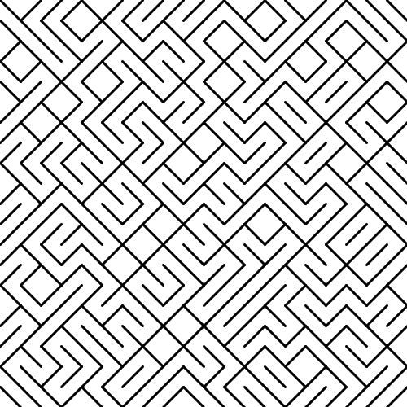
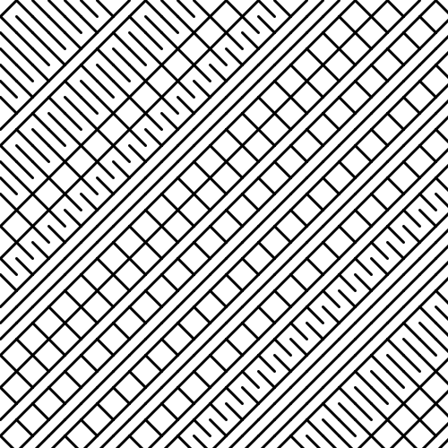

# quil generative art

Learning generative art with quil.

## Tiled lines
Inspired by [generative artistry](https://generativeartistry.com/tutorials/tiled-lines/).

Random pattern using 25 steps. In this pattern the seed when deciding the line direction is totally random, achieving a maze-like pattern.

Not so random pattern, with a lower step rate. There is a repetition pattern in the seed. I would like to plot this graphically to really grasp what is going on. `(+ x y)` is being used as seed when deciding whether to turn left or right when drawing the line. So, any steps like `[0 300]`, `[100 200]`, and `[300 0]` are all using the same seed and going to the same direction. Maybe there are some other interesting patterns that can be forced by manipulating the generator seed like this?

